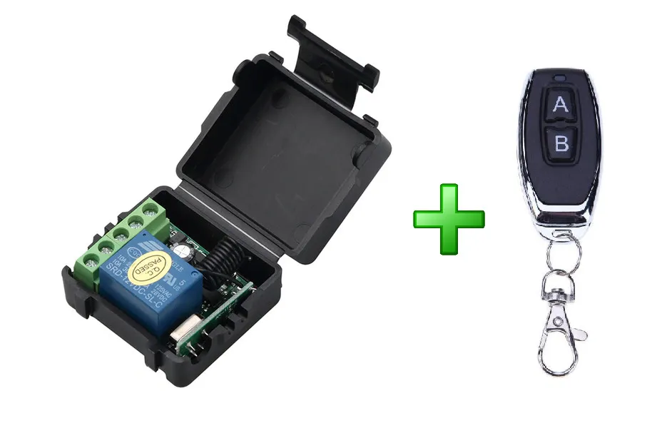

# SmartHome

Project **_SmartHome_** - automate system smart home which can manage different devices, sensors and cameras. SmartHome provides control scenarios  

## Supported protocols

| Protocol    | support |
|-------------|---------|
| wi-fi       | No      |
| zigbee      | No      |
| 433MHz-wave | Yes     |

### 433MHz-wave
for instance I use radio relay with 433Mhz receiver


## Plans
- **Support _zigbee_**
  - Add support of protocol **zigbee** to ensure compatibility with devices from different manufacturers.
- **Support cameras**
  - Add connect wifi cameras to SmartHome.
- **Scenarios**
  -  Support scenarios between devices 

## Launch
```bash
# backend
uv sync
source .venv/bin/activate
cd backend
make run-dev-server # or run-prod-server

# frontend
cd frontend
npm install
npm run serve
```

